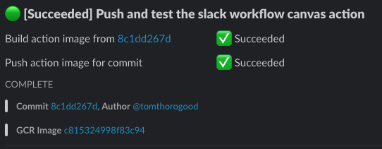

# Update Slack Workflow Canvas Action

This action creates or updates a workflow status, 
and outputs the status canvas so that it can be 
carried throughout an entire Actions workflow.



If you are part of the [UWIT-IAM organization](https://github.com/uwit-iam/), 
you can opt to use the 
[workflow template](https://github.com/UWIT-IAM/.github/blob/main/workflow-templates/slack-workflow-canvas.yml) 
to create a boilerplate canvas that will "just work."

See [Github's documentation](https://docs.github.
com/en/actions/learn-github-actions/sharing-workflows-with-your-organization#using-a-workflow-template-from-your-organization) 
on to learn how to include this in your repository in just a few clicks! 


### Style using mrkdwn

No, not markdown, [mrkdwn](https://api.slack.com/reference/surfaces/formatting#basics). 

This is a Slack thing. It's limited, but functional.

### One message per workflow execution

The action maintains the state of a single message (referred to herein as a 
canvas) throughout the workflow execution, then "freezes" it when your workflow is 
finalized. If the workflow is re-run, a new message will appear in the designated 
channel.

### Iconography for at-a-glance statuses:

This uses some (not cute or animated) emoji to add some iconography for the various 
states of a step. All workflows using this action will have the same iconography and 
steps, which makes the tool more helpful for everyone. 


### Standalone app can be used however you like

You don't have to use actions to use the app! 

Even if you are outside of UW-IT, you can use this app as a standalone docker 
image provided you meet the following pre-requisites:

- A Google Datastore service credential that is able to create and delete entities 
  in the `github-actions` namespace, using the kinds `SlackWorkflowCanvas` and 
  `SlackWorkflowLock`. **Please feel free to submit a PR to support other temporary 
  data storage backends**
- A slack bot token that can create and edit messages in the channel(s) that you 
  will be using. 

You can use the docker container and bring your own bot token. Likewise, you can use
the default entrypoint to configure everything via environment variable, or override
the entrypoint to use the CLI `run.py` instead.


### Safe for parallel jobs

It is possible to use this action in jobs that run in parallel. This action comes
with a locking mechanism so that only one job can "check out" the workflow canvas at
a time to update it. Note: This is currently not optional, and requires access to 
Github Datastore. (Repos in the UWIT-IAM organization get this automatically).

### Flexible use cases

You can define your entire workflow at the beginning, or add or remove steps ad-hoc as 
your workflow progresses. 

For available commands, see [commands](#command).

## Inputs

(alphabetical)

<a id='input-canvas-id'></a>
### `canvas-id`
**USUALLY REQUIRED**. This must be a pseudo-unique identifier that links your change to 
the running workflows. If not provided, it can be randomly generated and output from 
the `create-canvas` command. 

Exception: You do not need to provide this when you run the `create-canvas` command, 
it will be auto-generated for you, and can be accessed in the 
[output](#output-canvas-id).

The id only needs to be
unique within the scope of the time that workflow is running; it's ok if the id is
repeated on future runs. A safe bet is 
`${{ github.run_id }}.${{ github.run_number }}`, but really, any string will do.

### `channel`
**REQUIRED** if command is `create-canvas`**, otherwise ignored. Sets the
channel for the workflow canvas. 

If you want to send messages to more than one channel per workflow, you need to 
maintain more than one canvas.

### `command`
**Required** One of the [available action commands](#available-commands).

Any command that creates or updates the canvas will also output a `lock-id`, which 
can be useful for debugging, if you find that locks are not breaking as they should.

All commands except for `create-canvas` require the 
[`input-canvas-id`](#input-canvas-id) argument.


### `description`
**Required** if command is `add-artifact`, `create-workflow`.
**Optional** if command is `create-step`, `update-workflow`.

If the command is `create-workflow`, the description may only include plain text.
All other uses allow Slack's proprietary `mrkdwn` syntax.


### `step-id`
**Optional** if command is `create-step`, `update-workflow`, otherwise _ignored_.
This needs to be unique within your workflow. If not provided during `create-step`, 
one will be autogenerated and output from the `create-step` command as `step-id`.

### `step-status`

**Optional**, if the command is `create-step` or `update-workflow`.

Defaults to `not started`.

Must be one of the following strings:

- not started
- in progress
- skipped
- succeeded
- failed

### `workflow-status`

**Optional** if the command is `create-workflow`, `create-step`, `update-workflow`, 
`add-artifact`, `finalize-workflow`. 

Any of the following strings:

- initializing
- in progress
- succeeded
- failed

NB: Because the Slack messaging is part of the workflow, the workflow itself is 
never in a state of 'not started,' therefore defaulting to 'initializing'.


## Outputs

(alphabetical)

<a id='output-canvas-id'></a>
### `canvas-id`

From `create-workflow`

The pseudo-unique id of the Slack "canvas" used to track the workflow status. This is 
used to look up and update the message in later steps. 

### `fingerprint`

From _all commands_: The SHA256 fingerprint of the code behind the action; this can
be used for debugging or version validation. (This is calculated using the actions
`hashFiles` function.)

### `step-id`

From `create-step`

The unique id of the step just created. If not explicitly provided, this output must be
used to update the workflow step.


## Example Use

The following is an annotated example that demonstrates this action's features and 
how you might want to apply them.

To see an example workflow, complete with annotations, that actually runs, you can 
view the public template in the 
[UWIT-IAM/.github](https://www.github.com/UWIT-IAM/.github/tree/main/workflow-templates) 
repository. Note that the template will only work as-is for repositories in the 
UWIT-IAM orgnization.

## Development

### To-dos

- Template support
  - Support defining templates within a repository that can be provided to workflows,
    so that the default state can be provided instead of having to define every step 
    inside the Action.
    

### Action architecture

- The action app, `/action/*.py` (the python code) is responsible for 
  the business logic.. It is mostly decoupled from the other interfaces, 
  except for that it does print Github 
  Actions commands itself (`set-output`, for example). This means that it can run
  independently of the action for testing and development, and that you will see 
  the output that github itself consumes when the code runs inside an action.
- The `entrypoint.sh` script, serves as the [Docker](Dockerfile) entrypoint; 
  by building and running the [Dockerfile](Dockerfile) image, you are executing this 
  script. This script takes no arguments, and requires environment variables be set.
  This is by design. (See below.)
- The `action.yml` is how github consumes the action configuration, and is also used 
  as a reference artifact for people who want to use this action. 
- The `run-from-env.sh` script is a way to run the action _as if you were executing 
  an Actions workflow_. This is also how the action is able to test itself before 
  deploying to the docker repository. To do this yourself, you need a copy of the 
  slack bot api token. For now, just ask Tom if you need this.
  
> Why is the entrypoint environment-variable driven?

I chose this design because it allows a unified interface that allows the action to 
be run the same way for both consuming workflows and developers who want to test 
this action, as well as for Github Actions to test this action itself.

The `action.yml` is really only responsible for setting environment variables; it 
loads directly into a pre-built docker container and simply runs the `entrypoint.sh` 
which is responsible for translating the environment variables into command-line 
arguments.

This results in a modular set up that allows multiple different commands to be run 
the same way for everyone, and using the same action interface. 

Lastly, the application code is sufficiently decoupled from the running context that 
either could be factored somewhere else with ease. The action only knows about its 
runtime image; the image entrypoint only knows how to translate the request to one 
the app can read; the app can be run and tested by humans, and scaled independently 
of the interface to Actions.

If you don't like it, you can always run with the entrypoint `python run.py` instead,
and then use CLI args instead of environment variables.


## Available Commands

### `create-canvas`

Creates a workflow canvas to be used throughout your workflow. You have two options
available for creating canvases: 

- If you have more than a couple of steps in your workflow, it's easier to [create your 
  workflow using JSON](#example-using-json).
- Otherwise, it's simpler to just supply the `description` and (optionally) 

Outputs: [`canvas-id`](#output-canvas-id).

#### Example using JSON

You can create steps in bulk by describing your canvas in json. This is also 
much faster, as it runs the creation and default state population in a single step.

```
uses: uwit-iam/actions/update-slack-workflow-canas@release
env:
  SLACK_CANVAS_ID: integ/${{ github.run_id }}/${{ github.run_number }}
with:
  command: create-canvas
  json: >
    {
      "description": "Integration tests for ${{ github.repository }}",
      "workflowId": "${{ env.SLACK_CANVAS_ID }}",
      "channel": "#workflow-notifications",
      "status": "in progress"
      "steps": [
        {
          "stepId": "build images",
          "status": "in progress",
          "description": "Build docker images from change ${{ github.sha }}",
        }, {
          "stepId": "run tests",
          "description": "Run all the tests!",
        }
      ]
    }
```

### `create-step`


Adds a step to workflow canvas.
This can be done at any time until the workflow is finalized, allowing you to
dynamically add steps in branching workflows.

Requires arguments: [`step-id`](#step-id), [`description`](#description)


### `remove-step`
Removes one or more steps from the workflow canvas. This can be helpful to clean up
steps that aren't interesting once your workflow is complete. (Thanks @krlowe for 
the suggestion).

Requires argument: `step-id`, which can be one or more (comma-separated) step ids; 
if an id cannot be found, a warning will be logged, but the workflow will continue 
without error. You can also supply the value `'*'` \[sic] to strip _all_ steps, 
leaving only _artifacts_ behind. Therefore, if you choose to use this command, 
it is recommended to store enough 
context as an artifact on your canvas that any changes that may have resulted from
your workflow are easily traced.

Accepts argument: [`step-status`](#step-status). You may provide a (comma-separated) 
list of defined statuses to filter by; only steps that match the filter will be 
removed. (This can be useful if you want to keep a step that failed on a canvas, for 
instance.)

_Example: Remove all steps that succeeded_
```
with:
  command: remove-step
  step-id: '*'
  step-status: succeeded
```


### `update-workflow`

With this command you can update the overall workflow status and/or any number of 
step statuses. (You must include exactly the same number of 
[`step-status`](#step-status) values as [`step-id`](#step-id) values).

Example: 

```
if: failure()
with:
  command: update-workflow
  workflow-status: failed
  step-id: deployment-validation, rollback
  step-status: failed, in progress
```

### `add-artifact`

_Artifacts_ are intended to be write-once, read-forever items on your canvas. Once 
added, an artifact cannot be updated or removed. When designing your canvas, consider
which information will be needed only during execution, and which information will 
be needed for debugging later. 

Requires argument: `description`
This value can be any text/mrkdwn value that will render inside a block quote `> ` in 
slack. 

There is currently a limit of **9** artifacts per workflow, this ceiling is bound by 
Slack's API, which limits this block type to 10, reserving 1 for application use. 
However, you may supply multiple resource links in a single artifact, 
so find the balance that works best for you.

### `finalize-workflow`

**Recommended at the end of all workflows**. Marks the workflow as `COMPLETED`, 
regardless of whether it succeeded or failed, and also deletes the stored 
metadata that can be used to update the canvas. This "locks" the message displayed 
in Slack.

Omit this at your own risk, and certainly don't depend on any data that might 
persist if you decide to omit this command from your workflow.

As long as this command goes un-called for a given canvas-id, the canvas is 
subject to tampering by any bot token with access to the same channel, making it 
possible to rewrite history as seen from Slack. 
